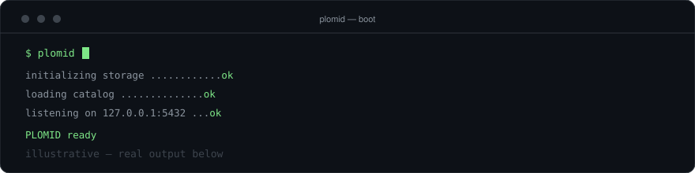

<picture>
  <source media="(prefers-color-scheme: dark)" srcset="../assets/logo_White.png">
  <source media="(prefers-color-scheme: light)" srcset="../assets/logo_BLACK.png">
  
</picture>

DATA INFRASTRUCTURE

# PLOMID

## Unified data infrastructure for modern applications.

PLOMID is building a unified data layer for SQL, JSON, time-series, vector, graph, and distributed workloads.

PLOMID — Platform for Modern Intelligence and Data

[Foundation](#01-foundation) · [Architecture](#03-architecture) · [Source](https://github.com/PLOMID/plomid) · [Issues](https://github.com/PLOMID/plomid/issues)

---

## 01 Foundation

### A unified data foundation

Modern applications work across relational data, documents, time-series streams, vectors, graphs, blobs, and distributed data. These are frequently handled through separate systems and infrastructure layers.

PLOMID explores a unified architecture where these workloads share a common underlying data foundation — a single infrastructure layer designed to support multiple data models and access patterns.

## 02 Data models

### Multiple models. One foundation.

PLOMID brings SQL, JSON, time-series, vector, graph, and distributed data workloads toward a common data infrastructure.

### One data layer

Applications increasingly combine different forms of data in a single workflow — a transaction that touches documents, a query that spans relational and analytical shapes, an agent that retrieves vectors alongside records.

Instead of treating every data model as an isolated system, PLOMID is designed around a shared infrastructure foundation: common storage, shared data management, a common transactional foundation, common metadata, and multiple access patterns over the same underlying data.

STORAGE · TRANSACTIONS · METADATA · ACCESS · PERSISTENCE

## 03 Architecture

Applications connect through familiar interfaces — including a PostgreSQL-compatible wire interface — and the platform is responsible for execution, transactions, and durable storage beneath them.

### Query → execution → storage

A request enters as a query, is parsed and planned, then executed; access and persistence resolve against the shared storage foundation.

## 04 Storage

### Built from the storage layer up.

PLOMID is approached from the underlying data infrastructure upward: durable pages and persistence first, then transactions and data management, then query and access.

## 05 Engineering

### Engineered as infrastructure.

PLOMID is engineered in Rust around the concerns of a storage-backed data system: query execution, transactions and MVCC, page management and persistence, write-ahead logging, checksums, indexing, and networked access.

RUST · STORAGE · TRANSACTIONS · MVCC · WAL · RECOVERY · INDEXING · QUERY EXECUTION · NETWORKING · PERSISTENCE

The emphasis is on correctness at the foundation — durability, transactional behavior, and clean layering — so that higher-level data models rest on infrastructure that is easy to reason about.

## 06 Access

### Data access

Different workloads require different access structures. The architecture distinguishes point lookups, ordered range access, and set filtering as separate access paths over shared stored data. Each structure serves its access pattern; the stored data beneath them remains part of the same foundation.

## 07 Runtime

### The system, in the terminal

PLOMID is built from the systems layer upward, with the development environment and runtime exposed directly through the command line.

## 08 Deployment

### Data where it belongs.

PLOMID is intended as infrastructure that deploys according to application and data requirements.

The design centers on flexible deployment and data placement — spanning deployment, residency, replication, access, and storage — giving infrastructure teams a foundation that can operate across cloud, on-premises, edge, and controlled environments.

DATA PLACEMENT · RESIDENCY · REPLICATION · ACCESS · JURISDICTION · STORAGE

## 09 Open engineering

### Built in the open.

The engineering work behind PLOMID lives in this organization:

- [Source](https://github.com/PLOMID/plomid) — the PLOMID implementation.
- [Issues](https://github.com/PLOMID/plomid/issues) — engineering discussion.

## System map

## Explore PLOMID

[Source](https://github.com/PLOMID/plomid) · [Issues](https://github.com/PLOMID/plomid/issues)

---

PLOMID
 Platform for Modern Intelligence and Data
  Unified data infrastructure for modern applications.

