

<picture>
  <source media="(prefers-color-scheme: dark)" srcset="../assets/logo_White.png">
  <source media="(prefers-color-scheme: light)" srcset="../assets/logo_BLACK.png">
  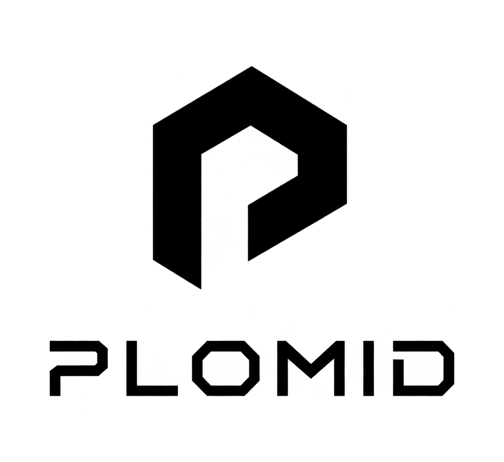
</picture>
 Platform for Modern Intelligence and Data

DATA INFRASTRUCTURE

# PLOMID

## Unified data infrastructure for modern applications.

PLOMID, a unified data layer for SQL, JSON, time-series, vector, graph, and distributed workloads.

[Foundation](#01-foundation) · [Architecture](#03-architecture) · [Storage](#04-storage) · [Access](#06-access) · [Source](https://github.com/PLOMID/plomid) · [Issues](https://github.com/PLOMID/plomid/issues)


---

## 01 Foundation

### A unified data foundation

Modern applications work across relational data, documents, time-series streams, vectors, graphs, blobs, and distributed data. These are frequently handled through separate systems and infrastructure layers.

PLOMID explores a unified architecture where these workloads share a common underlying data foundation — a single infrastructure layer designed to support multiple data models and access patterns.

## 02 Data models

### Multiple models. One foundation.


PLOMID brings SQL, JSON, time-series, vector, and graph workloads toward a common data infrastructure.

### One data layer

Applications increasingly combine different forms of data in a single workflow — a transaction that touches documents, a query that spans relational and analytical shapes, an agent that retrieves vectors alongside records.

Instead of treating every data model as an isolated system, PLOMID is designed around a shared infrastructure foundation: common storage, shared data management, a common transactional foundation, common metadata, and multiple access patterns over the same underlying data.

STORAGE · TRANSACTIONS · METADATA · ACCESS · PERSISTENCE

## 03 Architecture


Applications connect through familiar interfaces — including a PostgreSQL-compatible wire interface — and the platform is responsible for execution, transactions, and durable storage beneath them.

### Query lifecycle


A request enters as a query, is parsed, and is executed; access and persistence resolve against the shared storage foundation.

### Execution

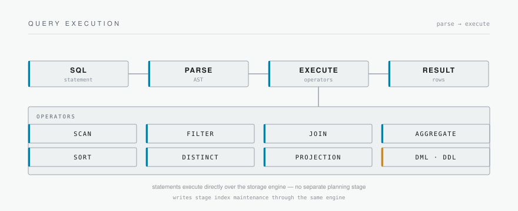

Statements execute directly over the storage engine through a fixed set of operators — scan, filter, join, aggregate, sort, distinct, and projection — along with DML and DDL. Reads and writes share the same path, and writes stage index maintenance alongside the row change. There is no separate planning stage.

## 04 Storage

### Built from the storage layer up.

PLOMID is approached from the underlying data infrastructure upward: durable pages and persistence first, then transactions and data management, then query and access.


### Pages and persistence

PLOMID stores data in fixed-size 16 KiB pages, each protected by a 48-byte header and a 4-byte CRC32C trailer. Writes move through the buffer pool into pages and blocks, then on to persistence. The buffer pool caches checksum-verified pages with LRU eviction, pin counting, and dirty tracking; CRC32C provides page-level integrity checking.



### Write-ahead log and recovery

Changes are logged before they reach data pages. A write appends a WAL record — begin, data, commit, or abort, each framed with a CRC32C checksum — and the record is made durable before buffered changes are applied to pages and persistence. Concurrent commits share a single fsync.

On restart, the engine replays committed records from the last checkpoint to reach consistent state. Records without a commit marker are not replayed.


## 05 Engineering

### Engineered as infrastructure.

PLOMID is engineered in Rust around the concerns of a storage-backed data system: query execution, transactions and MVCC, page management and persistence, write-ahead logging, checksums, indexing, and networked access.

RUST · STORAGE · TRANSACTIONS · MVCC · WAL · RECOVERY · INDEXING · QUERY EXECUTION · NETWORKING · PERSISTENCE

The engine is implemented in Rust (edition 2021, Apache-2.0). The workspace forbids unsafe code at the lint level (`unsafe_code = "forbid"`), so the storage, WAL, page, and index paths are written without `unsafe` blocks.

The emphasis is on correctness at the foundation — durability, transactional behavior, and clean layering — so that higher-level data models rest on infrastructure that is easy to reason about.

### Transactions and MVCC

PLOMID implements a transaction lifecycle — active, committed, aborted — over multi-version concurrency control. The row-version chain resolves by snapshot visibility, and committed data becomes durable.


## 06 Access

### Access paths for different workloads

PLOMID does not treat every query pattern as the same access problem. Different access structures serve different forms of data access, while the stored data beneath them remains part of the same foundation.


#### ART

An in-memory adaptive radix tree maps byte-string keys to logical row references for point and equality-oriented access. It is a derived runtime structure: reconstructed from the persistent B+tree payload of an index's current generation, maintained by the executor for each catalog index, and never authoritative — durability stays with the persistent tree.

#### B+tree

The persistent, ordered index. It reuses the existing page allocator, the 16 KiB page format, the CRC32C integrity boundaries, and the WAL recovery path, and serves ordered range access as well as point lookup.

#### BRIN

Block-range summaries over immutable columnar segment row intervals. Each range carries per-column zone maps so a range can be resolved as PRUNE, KEEP, or UNKNOWN before any of its rows are read.

#### Zone maps

Min/max/NULL summaries of immutable row ranges. A range predicate is compared against column bounds to skip physical regions that cannot match; NULL occupancy is tracked separately so a NULL row can never make a prune wrong.

#### Roaring

A compressed bitmap over a 32-bit value space, stored as array, bitmap, or run containers, providing exact candidate row-position sets.

#### XOR

A probabilistic membership filter over byte-string keys with no false negatives and an approximate false-positive rate. It only eliminates candidates: a negative answer skips exact evaluation, while a positive answer always falls through to exact processing.

ART · B+TREE · BRIN · ZONE MAP · ROARING · XOR — access structures over shared stored data

## 07 Runtime

### The system, in the terminal

 
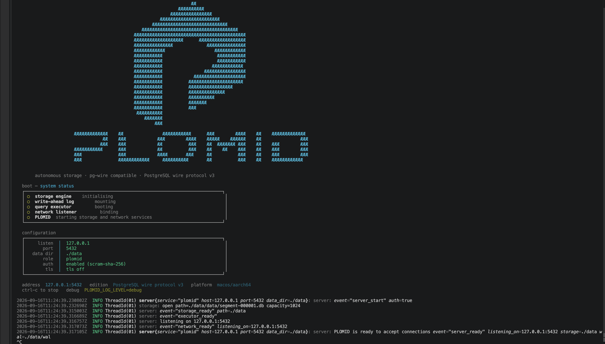 

PLOMID is built from the systems layer upward, with the development environment and runtime exposed directly through the command line.

## 08 Deployment

### Data where it belongs.

PLOMID is intended as infrastructure that deploys according to application and data requirements.

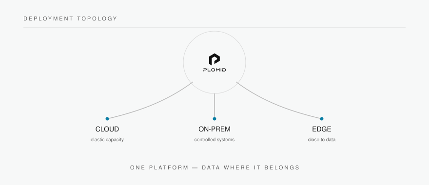

The design centers on flexible deployment and physical data placement — logical objects stay independent of where their bytes live, and durable segments are placed across registered devices — giving infrastructure teams a foundation that can operate across cloud, on-premises, edge, and controlled environments.

LOGICAL OBJECTS · SEGMENTS · PACKS · DEVICES · ALLOCATION · PERSISTENCE


## 09 Open engineering

### Built in the open.

The engineering work behind PLOMID lives in this organization:

- [Source](https://github.com/PLOMID/plomid) — the PLOMID implementation.
- [Issues](https://github.com/PLOMID/plomid/issues) — engineering discussion.

## System reference


## Explore PLOMID

[Source](https://github.com/PLOMID/plomid) · [Issues](https://github.com/PLOMID/plomid/issues)

---


PLOMID
 Platform for Modern Intelligence and Data

